# Analytics

The Analytics section allows the user to query all data related to their site on an ad hoc basis. Queries such as "show me all adolescent girls with exposures involving multiple agents" are possible. It does however require some knowledge to databases and how to construct queries.

## Stored Queries
It is also possible to run stored queries against your site. This allows a data manager to create queries and any user with the privileges to view Analytics to run them.

### Load Query

This will present the user with a list of queries saved against their site, selecting one will load it into the interface, ready to be run.

### Save Query

If you have built a query, it is possible to save it so others from your site can run it. It does require you to provide a unique name for the query to be identified by.

### Run Query

This executes the query. If the query is valid a result will appear in the result box and the option of downloading it will appear.

## Using the Analytics Interface
### Components
The Analytics user interface consists of three main components – an Entities Panel, Conditions Panel, and Columns Panel. Data will be displayed in the Results Panel. The picture below can help you understand which is what.

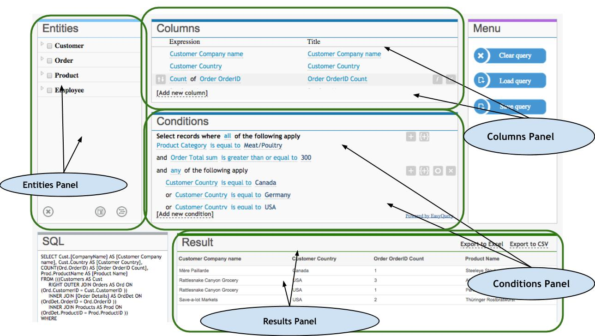

#### Entities Panel
This panel can be used as a visual representation of all entities and their attributes, which we can use to build queries. It can be used to add entity attributes to a Columns Panel (and they will be displayed in the result) or to a Conditions Panel (in order to actually set the query conditions).
You can either move selected attributes to the corresponding panels with a mouse or use buttons Add column and Add condition  (  ).

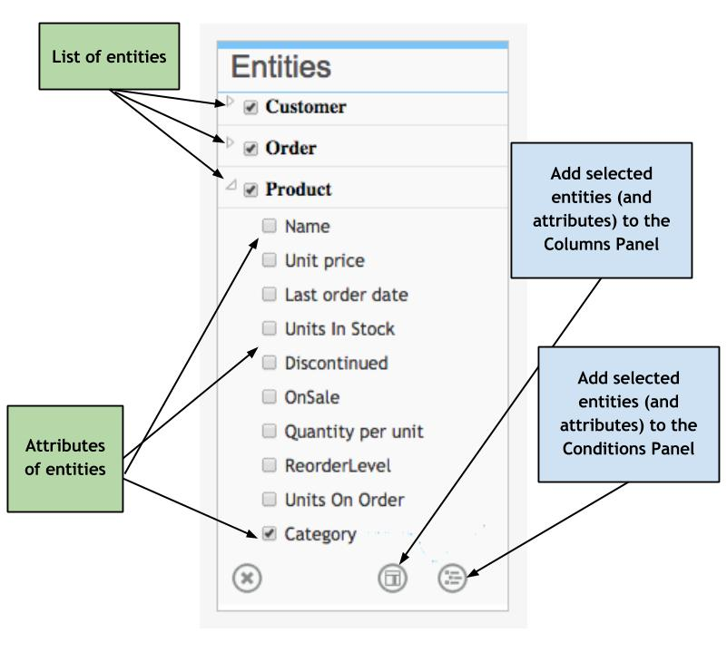

#### Columns Panel
Using columns panel you can specify the columns which you want to be displayed in your query results.

You have a list of lines, each of them represents a column in the query results (in the Results Panel). Every line consists of Expression, which is an attribute, a Title, which serves as a column title in the Results Panel, and buttons – for sorting (on the left), aggregating and deleting (on the right).
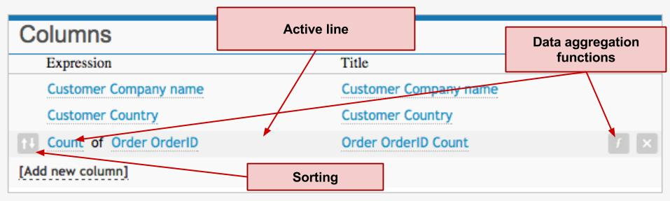

#### Conditions Panel
Here you can specify filtering conditions for data selection. So the result of your query will include only the data that satisfy those conditions.

Every line in the Conditions Panel corresponds to a single query condition. Every condition consists of 3 elements – an expression (some entity attribute), an operator, and value(s) (one or more).

We have mentioned attributes above (e.g., ‘Company Name,’ ‘Product Price,’ and ‘Order Date’). Together with values, operators set certain limitations regarding data which is stored in a given attribute. For example, “(Date) is equal to 23 Jul 2014,” “(Quantity) is greater than 35,” “(Price) is less than 1,000,” and “(Name) starts with A.”

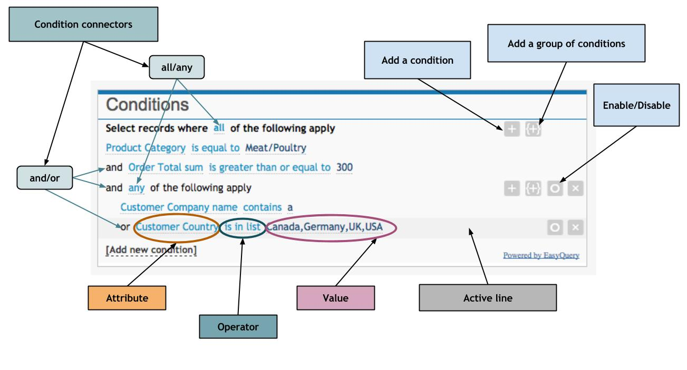

## Basic queries: how to make them with Analytics
### Display Table Data
Let us imagine that we need a table, which contains following data: names of our customer companies along with countries of their origin, names of categories in which they ordered products, and a total sum of orders each of them made.

So, we select following entities and their attributes to add them in the Columns Panel:

* Customer -> Company Name
* Customer -> Country
* Product -> Category
* Order -> Total Sum

Clicking on the Execute button displays our query result just as we need it.
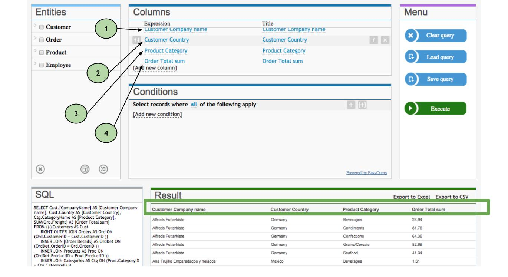

### Table Data with Aggregated Columns
Analytics allows to aggregate data for each column in the query result. For example, we may need a total quantity (amount) of the orders for every company.

We are going to add the following columns:

* Customer -> Company Name
* Customer -> Country
* Order -> Order ID (we need an attribute of the Order entity to calculate the amount of orders)

Click on the button and select the "Count" function
Change the title for last column to "Order Count" - just to represent its purpose.
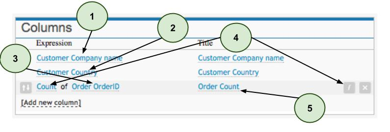

We get the following result:
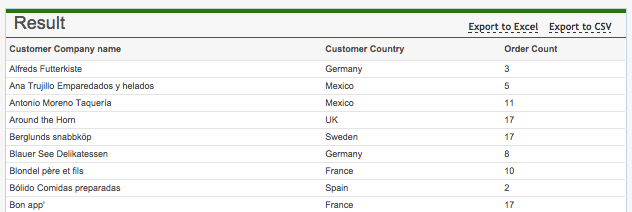

### Table Data with Sorting
Let us use the previous example, in which, as a result, we get columns with data on:

names of customer companies,
countries of their origin,
amount of products they paid for.
First steps are the same as in the previous example:

* Customer -> Company Name
* Customer -> Country
* Order -> Order ID

We make the last line active and select Count after clicking on the Function button
This time, let us sort data by the number of orders, in the descending order. To do this, we make the line Count of Order ID active, click on the sorting icon and select Descending

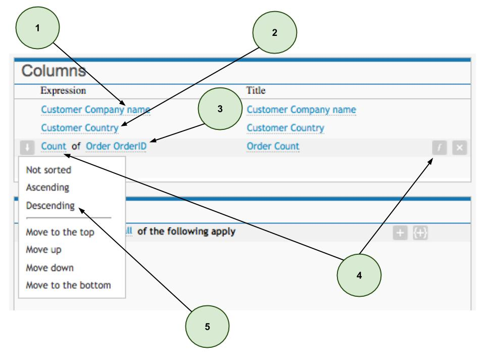

Results are displayed according to the number of orders made by every company, in the descending order.

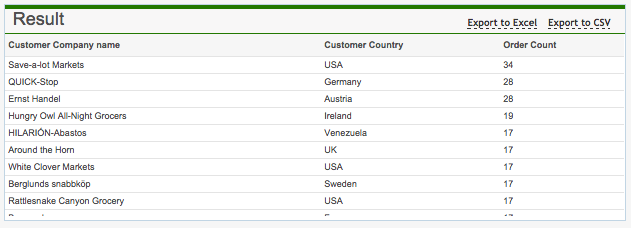
### Filtering Data 1 (One Condition)
We often deal with situations when, for example, of all the customer companies, we must select only those who have purchased goods worth 450 or more. In cases like this, we should use the Conditions Panel for data sorting.

Let us do a sample query with the following data displayed: customer companies, countries of their origin, and total sum of their purchases. So, in the Columns Panel we select:

* Customer -> Country,
* Customer -> Name,
* Order -> Total sum.

Now we switch to the Conditions Panel and:

* add Order -> Total sum,

change the operator 'is equal to' to 'is greater than or equal to,'
and enter 450 in the value slot, as it is shown in the picture below.

It will look like this:

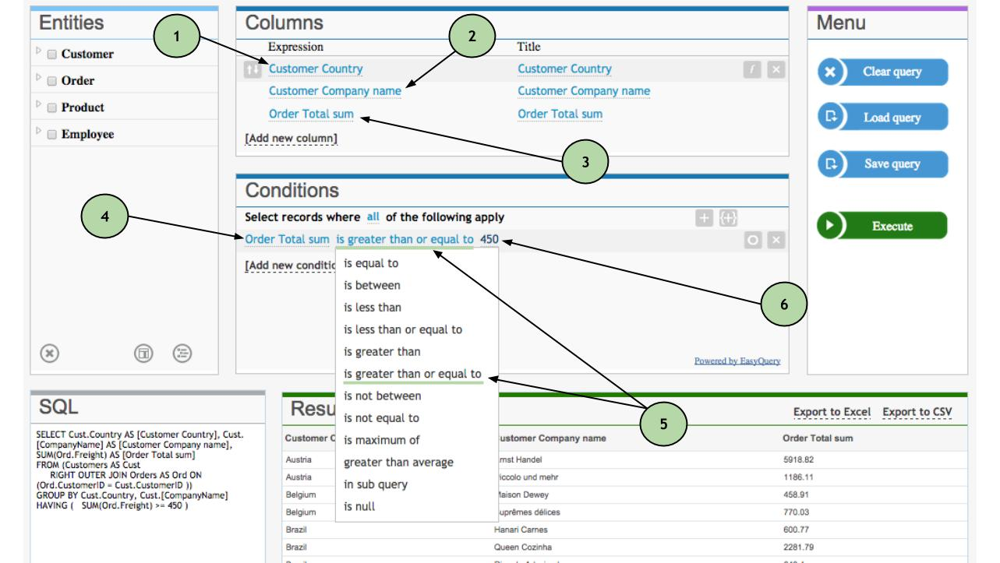
### Filtering Data 2 (Several Conditions)
Often we have not one, but several conditions for filtering data. For example, we need a list containing information on:

* customer companies from Germany,
* whose purchases are worth more than 450,
* and those purchased products are in the 'Dairy products' category.

Firstly, we need to specify that, if (by default) every new condition is an additional limitation to the existing ones, they are connected by a conjunction 'and.' In this particular case, it absolutely suits us, but we will show you how to change this (when necessary) a little bit later.

Thus, when building a query, we indicate first which columns to display, through the Columns Panel:

* Customer -> Company name,
* Customer -> Country,
* Order -> Total sum,
* Product -> Category,

then we add the following to the Conditions Panel:

* Order Total sum -> "is greater than" -> 450
* and: Product Category -> "is equal to" -> Dairy products
* and: Customer Country -> "is equal to" -> Germany

See how it looks below:

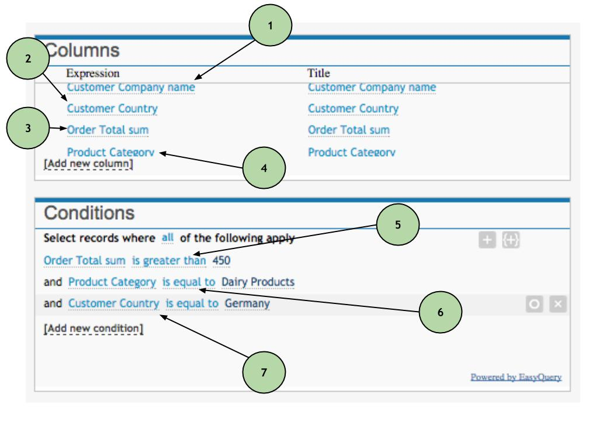
### Filtering Data 3 (Several Conditions with AND and OR Conjunctions)
Let us suppose that the query conditions in the example 5) have changed to the following:

We need a list of customer companies which:

* purchased a total of $450 worth of products
* in the Diary category,
* and their postal code contains 4 or 5.

In the Columns Panel, we select:

* Customer -> Company name,
* Order -> OrderID (f = Count),
* Product -> Name

We keep 'all' in the Conditions Panel's topmost line ("Select records where all of the following apply")
Using a  button, we add a condition: 

* Order -> Total sum -> "is greater than" -> 450
* and another condition: (and) Product -> Category -> "is equal to" -> Dairy Products

Next to the first line at the top, we add a group of conditions with the help of a symbol  and leave 'any' in a newly formed line.
Consistently, after "and any of the following apply," we add two conditions, by clicking a  button:

* Customer -> Postal code -> "is equal to" -> 4
* (or) Customer -> Postal code -> "is equal to" -> 5

It will look this way:

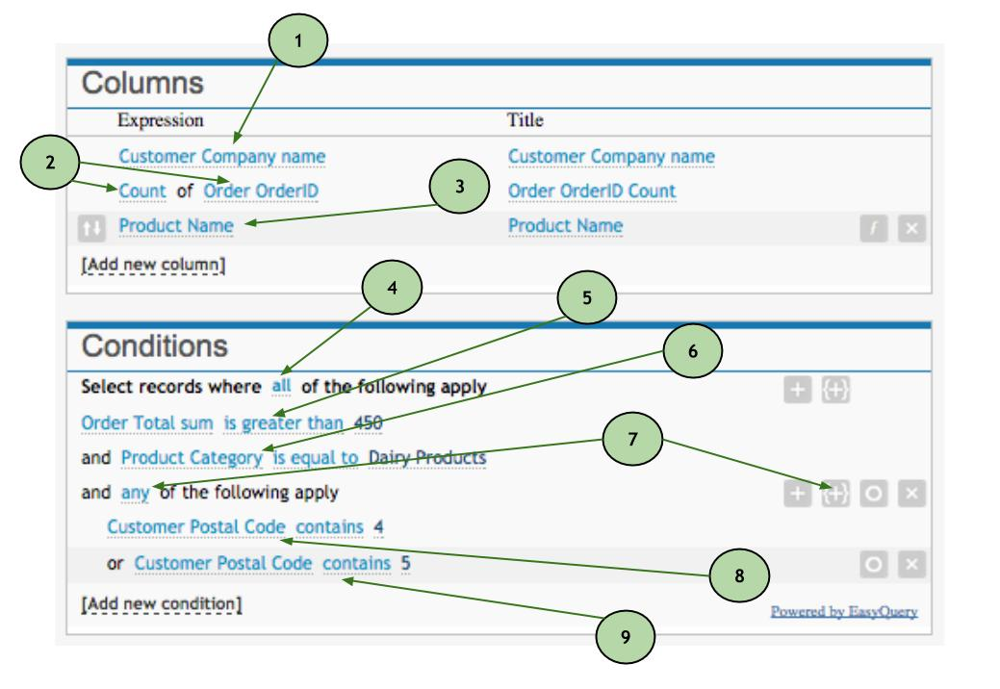
### Enabling/Disabling of Conditions
Let us assume that we are interested in a particular product - Aniseed Syrup. All we need to know is the list of companies that either have paid for their order, or have made an order starting from the first day of the year.
Therefore, we indicate the following in the Columns Panel:

* Customer -> Company name,
* Order -> Freight (f = Sum),
* Product Name (we will use it only to illustrate the example better).

In the Conditions Panel, we will take a set of steps:

* Product -> Product -> "is equal to" Aniseed Syrup

We create a group of conditions by clicking  and using 'any' in "and any of the following apply"

* Order -> Paid -> "is true"
* (or) Order -> Date -> "after (special)" -> First day of the year

Below is the visual representation of our steps:
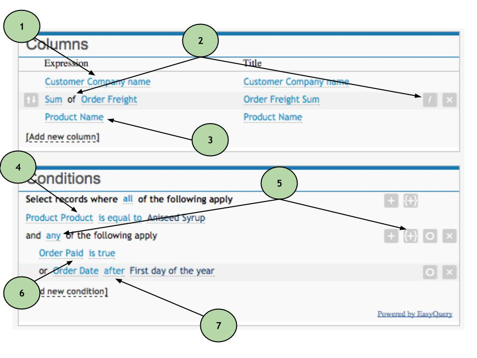

And the result we get:
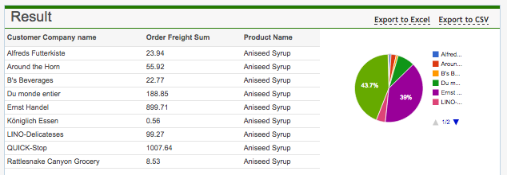

It can happen so that we will be needing only total sums of orders made after beginning of the year, or right the opposite - only orders which have been paid for (with no time restrictions).

There is an option of hiding particular conditions specifically for cases like this one. To the right of a condition itself, you will see a 'hide condition' button - . By clicking on it, we get a broader range of data we want to be displayed:
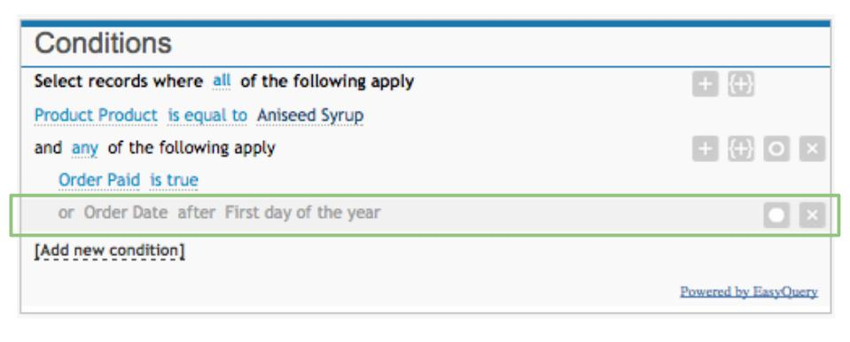
